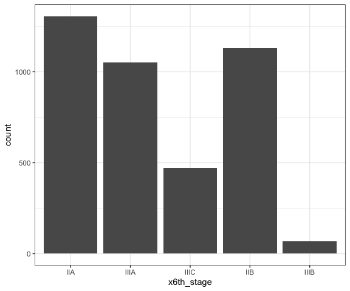
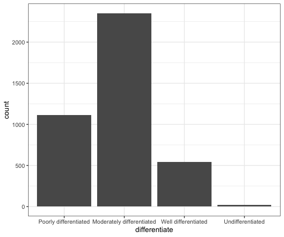
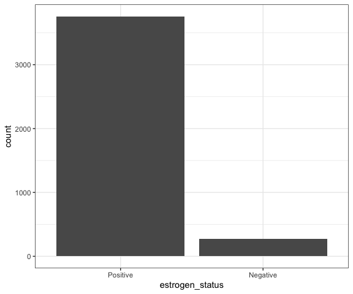
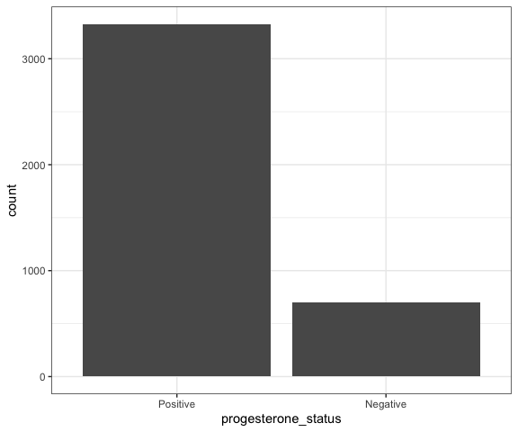
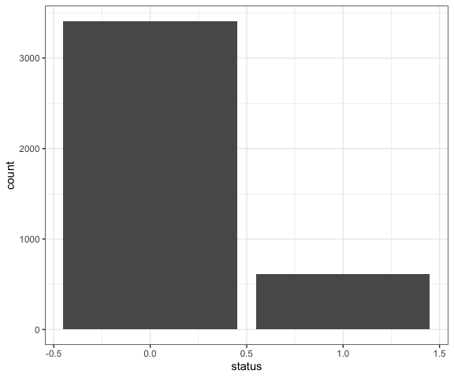

Untitled
================

### Load packages

``` r
# Load packages
library(tidyverse)
library(broom)
library(knitr)
library(modelr)

# Set default figure options
knitr::opts_chunk$set(
  fig.width = 6,
  out.width = "90%"
)

theme_set(theme_bw() + theme(legend.position = "bottom"))

options(
  ggplot2.continuous.colour = "viridis",
  ggplot2.continuous.fill = "viridis"
)

scale_colour_discrete = scale_colour_viridis_d
scale_fill_discrete = scale_fill_viridis_d
```

## Abstract

## Introduction (brief context & background of the problem)

dataset of breast cancer patients from a prospective study.

information was collected at baseline, survival months: length of
following up, status: survival status

interested in predicting risk of death based on some/or all predictors.

Variables in dataset:

1.  Age
2.  Race
3.  Marital Status
4.  T Stage: Adjusted AJCC 6th T
5.  N Stage: Adjusted AJCC 6th N
6.  6th Stage: Breast Adjusted AJCC 6th Stage
7.  Differentiate
8.  Grade
9.  A Stage: Regional — A neoplasm that has extended; Distant — A
    neoplasm that has spread to parts of the body remote from
10. Tumor Size: Each indicates exact size in millimeters.
11. Estrogen Status
12. Progesterone Status
13. Regional Node Examined
14. Reginol Node Positive
15. Survival Months
16. Status: Dead / Alive

<!-- -->

    ## Rows: 4024 Columns: 16
    ## ── Column specification ────────────────────────────────────────────────────────
    ## Delimiter: ","
    ## chr (11): Race, Marital Status, T Stage, N Stage, 6th Stage, differentiate, ...
    ## dbl  (5): Age, Tumor Size, Regional Node Examined, Reginol Node Positive, Su...
    ## 
    ## ℹ Use `spec()` to retrieve the full column specification for this data.
    ## ℹ Specify the column types or set `show_col_types = FALSE` to quiet this message.

``` r
unique(breast_cancer$`x6th_stage`)
```

    ## [1] IIA  IIIA IIIC IIB  IIIB
    ## Levels: IIA IIIA IIIC IIB IIIB

``` r
logistic_model =
  breast_cancer |> 
  glm(status ~ . + estrogen_status*progesterone_status, data = _, family = binomial())
```

``` r
opt_model =
  logistic_model |> 
  MASS::stepAIC(
    direction = "both",
    k = 2)
```

    ## Start:  AIC=3007.43
    ## status ~ age + race + marital_status + x6th_stage + differentiate + 
    ##     a_stage + estrogen_status + progesterone_status + root_tumor_size + 
    ##     regional_prop + estrogen_status * progesterone_status
    ## 
    ##                                       Df Deviance    AIC
    ## - a_stage                              1   2965.8 3005.8
    ## - estrogen_status:progesterone_status  1   2965.9 3005.9
    ## - marital_status                       4   2973.3 3007.3
    ## <none>                                     2965.4 3007.4
    ## - root_tumor_size                      1   2967.7 3007.7
    ## - race                                 2   2981.0 3019.0
    ## - age                                  1   2983.3 3023.3
    ## - x6th_stage                           4   2995.0 3029.0
    ## - differentiate                        3   2999.8 3035.8
    ## - regional_prop                        1   3007.8 3047.8
    ## 
    ## Step:  AIC=3005.84
    ## status ~ age + race + marital_status + x6th_stage + differentiate + 
    ##     estrogen_status + progesterone_status + root_tumor_size + 
    ##     regional_prop + estrogen_status:progesterone_status
    ## 
    ##                                       Df Deviance    AIC
    ## - estrogen_status:progesterone_status  1   2966.3 3004.3
    ## <none>                                     2965.8 3005.8
    ## - marital_status                       4   2973.9 3005.9
    ## - root_tumor_size                      1   2968.1 3006.1
    ## + a_stage                              1   2965.4 3007.4
    ## - race                                 2   2981.3 3017.3
    ## - age                                  1   2983.6 3021.6
    ## - x6th_stage                           4   2999.5 3031.5
    ## - differentiate                        3   3000.0 3034.0
    ## - regional_prop                        1   3008.1 3046.1
    ## 
    ## Step:  AIC=3004.31
    ## status ~ age + race + marital_status + x6th_stage + differentiate + 
    ##     estrogen_status + progesterone_status + root_tumor_size + 
    ##     regional_prop
    ## 
    ##                                       Df Deviance    AIC
    ## <none>                                     2966.3 3004.3
    ## - marital_status                       4   2974.4 3004.4
    ## - root_tumor_size                      1   2968.6 3004.6
    ## + estrogen_status:progesterone_status  1   2965.8 3005.8
    ## + a_stage                              1   2965.9 3005.9
    ## - race                                 2   2981.8 3015.8
    ## - estrogen_status                      1   2983.5 3019.5
    ## - age                                  1   2984.1 3020.1
    ## - progesterone_status                  1   2985.4 3021.4
    ## - x6th_stage                           4   2999.9 3029.9
    ## - differentiate                        3   3000.3 3032.3
    ## - regional_prop                        1   3008.7 3044.7

``` r
opt_model |> 
  glance()
```

    ## # A tibble: 1 × 8
    ##   null.deviance df.null logLik   AIC   BIC deviance df.residual  nobs
    ##           <dbl>   <int>  <dbl> <dbl> <dbl>    <dbl>       <int> <int>
    ## 1         3445.    4023 -1483. 3004. 3124.    2966.        4005  4024

``` r
opt_model |> 
  tidy()
```

    ## # A tibble: 19 × 5
    ##    term                                   estimate std.error statistic  p.value
    ##    <chr>                                     <dbl>     <dbl>     <dbl>    <dbl>
    ##  1 (Intercept)                             -4.20     0.369      -11.4  5.15e-30
    ##  2 age                                      0.0234   0.00559      4.18 2.92e- 5
    ##  3 raceBlack                                0.506    0.162        3.13 1.75e- 3
    ##  4 raceOther                               -0.431    0.202       -2.13 3.30e- 2
    ##  5 marital_statusDivorced                   0.222    0.141        1.57 1.15e- 1
    ##  6 marital_statusSingle                     0.153    0.134        1.15 2.52e- 1
    ##  7 marital_statusWidowed                    0.225    0.192        1.17 2.42e- 1
    ##  8 marital_statusSeparated                  0.847    0.366        2.32 2.06e- 2
    ##  9 x6th_stageIIIA                           0.563    0.163        3.46 5.41e- 4
    ## 10 x6th_stageIIIC                           1.06     0.193        5.50 3.70e- 8
    ## 11 x6th_stageIIB                            0.413    0.154        2.68 7.45e- 3
    ## 12 x6th_stageIIIB                           1.14     0.322        3.55 3.91e- 4
    ## 13 differentiateModerately differentiated  -0.389    0.104       -3.73 1.95e- 4
    ## 14 differentiateWell differentiated        -0.919    0.192       -4.78 1.79e- 6
    ## 15 differentiateUndifferentiated            0.961    0.529        1.82 6.93e- 2
    ## 16 estrogen_statusNegative                  0.738    0.177        4.17 3.06e- 5
    ## 17 progesterone_statusNegative              0.571    0.127        4.49 7.28e- 6
    ## 18 root_tumor_size                          0.0477   0.0313       1.52 1.28e- 1
    ## 19 regional_prop                            1.24     0.185        6.69 2.30e-11

``` r
opt_model |> 
  car::vif()
```

    ##                         GVIF Df GVIF^(1/(2*Df))
    ## age                 1.106663  1        1.051981
    ## race                1.058531  2        1.014322
    ## marital_status      1.129834  4        1.015376
    ## x6th_stage          2.245276  4        1.106391
    ## differentiate       1.115872  3        1.018441
    ## estrogen_status     1.478803  1        1.216060
    ## progesterone_status 1.430061  1        1.195851
    ## root_tumor_size     1.450567  1        1.204395
    ## regional_prop       1.580122  1        1.257029

``` r
breast_cancer = 
  breast_cancer |> 
  add_residuals(opt_model) |> 
  add_predictions(opt_model)
```

``` r
breast_cancer |> 
  ggplot(aes(sample = resid)) +
  stat_qq() +
  stat_qq_line()
```


``` r
breast_cancer |> 
  ggplot(aes(x = pred, y = resid)) +
  geom_point()
```


``` r
## Commented out because t_stage is removed at data import
#breast_cancer |> 
  #ggplot(aes(x = `t_stage`)) +
  #geom_bar()
```

``` r
## Commented out because n_stage is removed at data import
#breast_cancer  |> 
  #ggplot(aes(x = `n_stage`)) +
  #geom_bar()
```

``` r
breast_cancer %>%
  ggplot(aes(x = `x6th_stage`)) +
  geom_bar()
```



``` r
breast_cancer %>%
  ggplot(aes(x = differentiate)) +
  geom_bar()
```



``` r
## Commented out because grade is removed at data import
#breast_cancer %>%
  #ggplot(aes(x = grade)) +
  #geom_bar()
```

``` r
breast_cancer %>%
  ggplot(aes(x = `estrogen_status`)) +
  geom_bar()
```



``` r
breast_cancer %>%
  ggplot(aes(x = `progesterone_status`)) +
  geom_bar()
```



``` r
breast_cancer %>%
  ggplot(aes(x = status)) +
  geom_bar()
```



    ## `stat_bin()` using `bins = 30`. Pick better value with `binwidth`.
    ## `stat_bin()` using `bins = 30`. Pick better value with `binwidth`.


