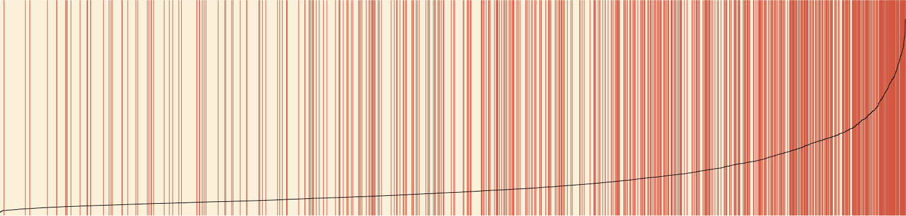
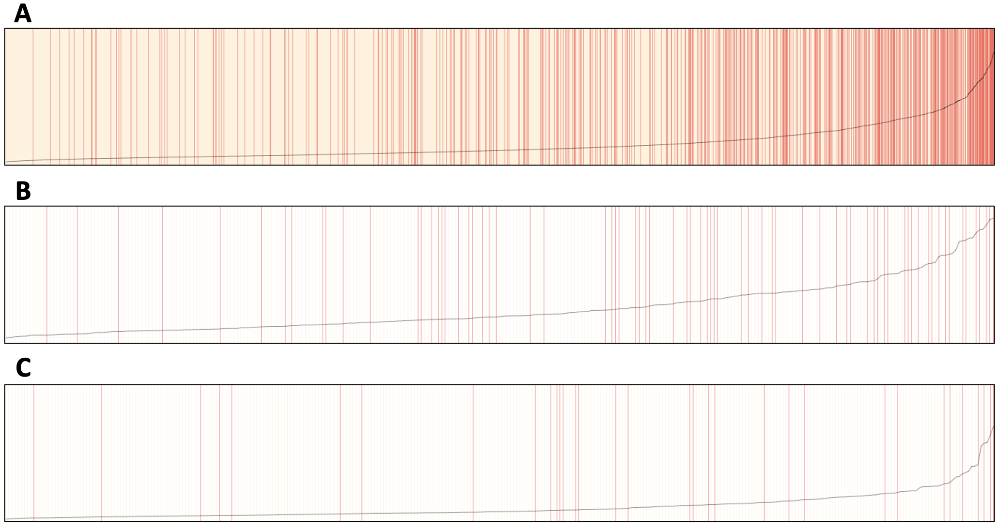

```{r load packages and default options, include = FALSE}
# Load packages
library(separationplot)
library(tidyverse)
library(broom)
library(knitr)
library(modelr)
library(pROC)
library(gtsummary)

# Set default figure options
knitr::opts_chunk$set(
  fig.width = 6,
  out.width = "90%"
)

theme_set(theme_bw() + theme(legend.position = "bottom"))

options(
  ggplot2.continuous.colour = "viridis",
  ggplot2.continuous.fill = "viridis"
)

scale_colour_discrete = scale_colour_viridis_d
scale_fill_discrete = scale_fill_viridis_d
```

## Abstract

Studies have shown that there are many risk factor combinations for breast cancer. Fortunately, breast cancer survival rates have increased and number of deaths have decreased. Nevertheless, it is important to explore the most significant breast cancer risk factors to identify at-risk groups for further research. To do so, we used a dataset containing demographic and risk factors information, and survival status by patients. After cleaning and exploring the data, we dropped highly correlated variables, combined others, and performed transformations. We then built the full model, containing an interaction between estrogen and progesterone status, and selected the best model using Akaike Information Criterion (AIC). Overall, our final model had a good ROC-AUC and Brier score values. 

## Introduction

Breast cancer occurs due to abnormal cell growths in breast tissue. Although it is most often found in females, 1 out of every 100 diagnosed patients in the US is a male. Other breast cancer risk factors include, increase in age, family history or personal history of breast cancer, radiation exposure, obesity, alcohol use, among many more. Research suggests that postmenopausal hormone therapy is a risk factor due the combination of estrogen and progesterone used to treat signs and symptoms of menopause. 

Additionally, the patient's breast cancer stage is important to consider when determining the severity of the cancer and how to treat it. The American Joint Committee on Cancer (AJCC) TNM system is the most common, and contains clinical and pathologic systems. The pathologic stage is determined by examining the tissue removed during surgery, while the clinical stage is based on results of a physical exam, biopsy, and imaging tests. Nevertheless, both systems are composed of the size of the tumor, the spread to nearby lymph nodes and/or to distant sites, their estrogen and/or progesterone receptor status, the grade of the cancer, and if the cancer makes too much of HER2 protein. 

Although, most recently, breast cancer survival rates have increase and number of deaths decreased, it would be important to explore the risk factors of breast cancer. For this project, we will investigate the odds of breast cancer survival given most of the risk factors previously mentioned.


## Methods

#### Data source
  
We obtained a deidentified set containing data on 4024 breast cancer patients. this dataset contains both demographic information, such as patient age, race, and marital status; clinical information such as tumor stage, tumor size, hormone therapies (progesterone and estrogen), regional node positive, and regional node examined; and outcome information: the number of months the patient had survived prior to study conclusion, and their alive/dead status at the end of the study.

#### Data cleaning
  
We combined the regional node positive and regional node examined variables into a "regional node proportion positive" variable. This variable, but neither the node positive nor node examined variables were in the model. Further, we decided to discard the T stage and N stage variables, as they captured information already contained in the AJCC 6th stage variable. We also excluded the grade variable, as it captured the same clinical information as the differentiate variable. Due to the skewness in the distribution of the tumor size, we applied a square root transformation to that variable (**Supplemental Figure 1**). We also added a main_stage variable, which groups all the stages in `6th_stage` so that "IIIA" and "IIIC" are under factor level "III" for example, and added a white variable that tells us if the patient is "White" or not, essentially grouping "Black" and "Other" together. Both variables were created in case the reduction of factor levels makes the fit better.

```{r data import and tidying, include = FALSE}
breast_cancer <- read_csv('data/Project_2_data.csv') |> 
  janitor::clean_names() |> 
  rename(regional_node_positive = reginol_node_positive) |> 
  mutate(
    race = as_factor(race),
    marital_status = as_factor(marital_status),
    x6th_stage = as_factor(x6th_stage),
    differentiate = as_factor(differentiate),
    a_stage = as_factor(a_stage),
    root_tumor_size = sqrt(tumor_size),
    estrogen_status = as_factor(estrogen_status),
    progesterone_status = as_factor(progesterone_status),
    status = case_match(status,
                        "Dead" ~ 1,
                        "Alive" ~ 0),
    regional_prop = regional_node_positive/regional_node_examined,
    main_stage = case_when(
    str_detect(x6th_stage, "III") ~ "III",
    str_detect(x6th_stage, "II") ~ "II",
    str_detect(x6th_stage, "I") ~ "I",
    ),
    white = ifelse(race == "White", "White", "POC")) |> 
  dplyr::select(-c(regional_node_positive, regional_node_examined, survival_months,
            t_stage, n_stage, grade, tumor_size))
```


### Exploratory Data Analysis: Table 1

**Table 1** shows summary statistics for demographic variables, along with some variables related to breast cancer. They are split by whether they survived or not, with the first column being the summary statistics for the entire dataset. We noticed that although individuals had similar ages despite their status, Black individuals and widows died at a disproportional rate. Those that died also had higher root_tumor_size and regional_prop, which are variables related to cancer where higher values are more alarming.

```{r eda table, echo = FALSE, message = FALSE}
breast_cancer |>
   mutate(
    status = case_match(status,
                        1 ~ "Dead",
                        0 ~ "Alive"))|>
  select(status, age, race, marital_status, root_tumor_size, regional_prop) |>
  tbl_summary(by = status,
              statistic = list(
              all_continuous() ~ "{mean} ({sd})",
              all_categorical() ~ "{n} / {N} ({p}%)"
  ))  |>
  add_overall()
```


#### Model construction
  
We decided to use logistic regression model to estimate the risk of patient death within the followup window. Formally, we assumed that an for an individual, with probability *p* to die after receiving a breast cancer diagnosis, the log-odds of *p* was linear, i.e.

$logit(p_i) = \mathbf{X}\beta+ \epsilon_i$

Where ***X*** is the n x p design matrix, and $\beta$ is a vector in $\mathbb{R}^p$.

In addition to the covariates we included the interaction between `estrogen_status` and `progesterone_status` given that we found in our background research that having both "positive" increase the chances of breast cancer.

```{r construct full model, include = FALSE}
logistic_model =
  breast_cancer |> 
  glm(status ~ . + estrogen_status*progesterone_status, 
      data = _, family = binomial())
```


#### Model selection
  
We used a criterion-based method, utilizing Akaike Information Criterion (AIC) to assess the performance of our models.

```{r optimize model AIC, include = FALSE}
opt_model =
  logistic_model |> 
  MASS::stepAIC(
    direction = "both",
    k = 2,
    trace = 0)

summary(opt_model)
```

#### Model validation
  
We performed 10 cross-validation to assess the performance of our model. Each observation in a dataset will be in 1 of 10 folds such that it gets used as training data 9 times, and as test data once. The predictions are then saved such that each row has an out-of-sample prediction that can be compared to the real value.

```{r cross validation, include = FALSE}
breast_cancer$cv = sample(1:10, size = nrow(breast_cancer), replace = T)

test_dfs = list(n=10)

for (i in 1:10){
  
  train = breast_cancer |>
    filter(cv != i)
  
  test = breast_cancer |>
    filter(cv == i)
  
  model = glm(status ~ age + race + marital_status + x6th_stage +
                      differentiate + estrogen_status + progesterone_status + 
                                  root_tumor_size + regional_prop, 
                      data = train, family = binomial())
  
  test_probs = predict(model, newdata = test, type="response")
  
  test_preds = ifelse(test_probs >= 0.5, 1, 0)
  
  test$pred = test_preds
  
  test_dfs[[i]] = test
  
}
```

```{r out of sample prediction, include = FALSE}
out_of_sample_preds = bind_rows(test_dfs)
```


## Results

#### Model construction and selection

We used a logistic model coupled with criterion-based stepwise regression to determine which variables were useful in predicting the risk of death in breast cancer patients. The variables that were identified as important were age, race, marital status, AJCC 6th stage, differentiate, estrogen status, progesterone status, tumor size, and regional node positive proportion. Some variables that were not identified as important by the model were whether the tumor was Stage A and the interaction between estrogen and progesterone status. For a list of model coefficients see **Supplemental Table 1**.

#### Diagnostics

```{r roc, echo = FALSE, message = FALSE}
p = predict(opt_model,type="response")

y = breast_cancer$status

tmp = roc(y,p)

model_auc = tmp$auc
```

This is the ROC-AUC for full model on in-sample data, which is a measure that uses the model's specificity and sensitivity to get a score bounded by 0 and 1, where 1 is best. This model's ROC-AUC is `r round(model_auc, 3)`. 

```{r roc curve, echo = FALSE, message = FALSE}
plot(tmp)
model_auc = tmp$auc
```

```{r brier score full model, echo=FALSE, message=FALSE}
#adding predicted prob to model
breast_cancer <- breast_cancer %>%
  mutate(predicted_prob = predict(opt_model, type = 'response'))

predicted_prob <- predict(opt_model, type = 'response')

brier_score <- mean((predicted_prob-breast_cancer$status)^2)
```

A brier score was produced to assess the optimal model's performance. Brier score measures the accuracy of probabilistic predictions, where a score of 0 indicates perfect accuracy. The optimal model's brier score was `r round(brier_score, 3)`. This suggests that our final model has good probabilistic prediction accuracy. 

This separation plot shows that the model is able to reasonably effectively distinguish the patients that survived from those that died, though the low value of the predicted probability across the sample shows that it gives low probabilities of dying to all subjects.

```{r add prediction and residual, include = FALSE}
breast_cancer = 
  breast_cancer |> 
  add_residuals(opt_model) |> 
  add_predictions(opt_model) |> 
  mutate(p_hat = 1/(1 + exp(-pred)))
  
separationplot(pred = breast_cancer$p_hat, 
               actual = breast_cancer$status,
               newplot = F)
# This plot outputs a dataframe object that renders locally in R only
# We saved it as a png and then inserted it directly
```


**Figure 2.** Separation plot of model. Values are stripes, arranged in increasing predicted probability of death. The stripes are colored yellow if the patient survived, and red if they died. The black line indicates the predicted probability of death.


<<<<<<< HEAD
#### Model validation: Table 2. 
=======

#### Model validation
>>>>>>> 511626385f31142869e34514def5ef1c40c457ae

This table shows the confusion matrix made from our 10 fold cross-validation, such that the predicted values are out-of-sample predictors. Note that cells 1 and 4 (if read from left to right, and top-down) are individuals for which their status prediction was correctly predicted, and cells 2 and 4 are individuals for which their status wasn't correctly predicted.

**Table 1.** Confusion matrix of the model
```{r confusion matrix, echo = FALSE}
#rows are real values
c_matrix = table(out_of_sample_preds$status, out_of_sample_preds$pred) 
rownames(c_matrix) = c("Actually Died", "Actually Survived")
c_matrix |> 
  kable(col.names = c("Predicted Died", "Predicted Survived"))
```

#### Model performance by race

```{r aucs by race, include = FALSE}
tmp = roc(y[breast_cancer$race == "White"],p[breast_cancer$race == "White"])
white_auc = tmp$auc

tmp = roc(y[breast_cancer$race == "Black"],p[breast_cancer$race == "Black"])
black_auc = tmp$auc

tmp = roc(y[breast_cancer$race == "Other"],p[breast_cancer$race == "Other"])
other_auc = tmp$auc
```

```{r brier by race, include = FALSE}
white_breast_cancer <- breast_cancer %>%
  filter(race == 'White')
white_brier_score <- mean((white_breast_cancer$predicted_prob - white_breast_cancer$status)^2)

black_breast_cancer <- breast_cancer %>%
  filter(race == 'Black')
black_brier_score <- mean((black_breast_cancer$predicted_prob - black_breast_cancer$status)^2)

other_breast_cancer <- breast_cancer %>%
  filter(race == 'Other')
other_brier_score <- mean((other_breast_cancer$predicted_prob - other_breast_cancer$status)^2)
```


Lastly, model performance by race was explored using ROC AUC and Brier score values. The values by race are presented in the table below. The highest AUC was obtained for white patients, while the lowest brier score was obtained for the Other racial group.


**Table 2.** Model performance by race
```{r table of performance by race, echo = FALSE}
data.frame(race = c("White", "Black", "Other"),
           roc_auc = c(white_auc, black_auc, other_auc),
           brier_score = c(white_brier_score, black_brier_score,
                           other_brier_score)) |> 
  kable(digits = 3)
```

## Discussion

We constructed a model to predict the survival of breast cancer patients, and optimized it using a criterion based-selection approach. Most of the covariates in the dataset were identified by AIC as being useful predictors, with the exception of Stage A. Despite the combination of progesterone (PR+) and estrogen (ER+) receptors in breast cancer being of note clinically, our model did not find the interaction term between these variables to be worth including. This suggests that the adjusted odds ratio for risk of death in ER+/PR+ is 1.

The most significant predictor of death was the regional node positive proportion variable; an individual with 100% positive regional nodes has 3.5 times the odds of death compared with an individual who had no positive regional nodes. Other highly significant predictors were cancer stage (specifically whether the patient was IIIC),  whether the tumor was well differentiated (i.e. healthy cells), hormone receptors on the tumor (ER+ and PR+), and age.

Our model was effective at classifying patients who survived, but performed less well at classifying patients who died when using a $\hat{p}=0.5$ as the cutoff. The separation plot we constructed suggests that a lower cutoff, such as 0.35 may be more appropriate, and further tuning may improve model performance.

Our model was effective at classifying patients who survived, but performed less well at classifying patients who died when using a $\hat{p}=0.5$ as the cutoff. The separation plot we constructed suggests that a lower cutoff, such as 0.35 may be more appropriate, and further tuning may improve model performance.

Furthermore, conflicting conclusions occurred while assessing model performance by race. According to the ROC AUC values, the model performed better for White patients, then Black patients, then 'Other' race patients. On the contrary, the brier scores by race suggests that the model most accurately predicted probabilities for 'Other' race patients, followed by White and Black patients.

From our cross-validation confusion matrix, we can see that the model is very good at correctly predicting that somebody survived, and rarely predicts the individual died when it didn't. However, the model makes a lot of errors when trying to predict if the individual survived: more than 90% of the total error happens when the model predicts the individual died, and it actually survived. This reflects the fact that the model prefers to predict 0 as a result of the `status` variable being 0 inflated. 


## Author Contributions
Guadalupe wrote the abstract and introduction and performed model diagnostics (brier scores). Gustavo performed exploratory data analysis, model performance, and model diagnostics (ROC curves). Derek did the data cleaning, model construction, and diagnostics (separation plot). All authors contributed to the writing of the results and the discussion.

## References

American Cancer Society. Breast Cancer Stages. Atlanta, GA: American Cancer Society, Inc. Available from: [https://www.cancer.org/cancer/types/breast-cancer/](https://www.cancer.org/cancer/types/breast-cancer/understanding-a-breast-cancer-diagnosis/stages-of-breast-cancer.html#:~:text=The%20earliest%20stage%20breast%20cancers,means%20cancer%20has%20spread%20more.)

Division of Cancer Prevention and Control, Centers for Disease Control and Prevention. Breast Cancer in Men. Atlanta, GA: Centers for Disease Control; 2023 July 25. Available from: [https://www.cdc.gov/cancer/breast/men/](https://www.cdc.gov/cancer/breast/men/index.htm#:~:text=Breast%20cancer%20is%20most%20often,is%20found%20in%20a%20man.&text=Invasive%20ductal%20carcinoma.,parts%20of%20the%20breast%20tissue.)

Greenhill B, Ward MD, Sacks A. The separation plot: A new visual method for evaluating the fit of binary models. American Journal of Political Science. 2011;55(4):991–1002. doi:[10.1111/j.1540-5907.2011.00525.x](https://www.jstor.org/stable/23025132)

Mayo Clinic. Breast Cancer. Rochester, MN: Mayo Foundation for Medical Education and Research. Available from: [https://www.mayoclinic.org/diseases-conditions/breast-cancer](https://www.mayoclinic.org/diseases-conditions/breast-cancer/symptoms-causes/syc-20352470)

Stoica P, Selen Y. Model-order selection: a review of information criterion rules. IEEE Signal Processing Magazine. 2004;21(4):36–47. [doi:10.1109/msp.2004.1311138](https://ieeexplore.ieee.org/document/1311138) 

Young Survival Coalition. Breast Cancer 101. New York, NY: Young Survival Coalition. Available from: [https://youngsurvival.org/breast-cancer](https://youngsurvival.org/breast-cancer-101?gad_source=1&gclid=CjwKCAiAg9urBhB_EiwAgw88mcI-WsyaKEn-nTaWET71dtNVebk2y3qHMeLMjBnxk42z-sE5LMbPPRoCLZYQAvD_BwE)


#### Software
  
The aforementioned analyses were carried out using R 4.3.1 and RStudio Version 2023.06.2+561.

\newpage
## Supplemental Information

#### Table S1. Model Coefficients
```{r model coefficients, echo = FALSE}
opt_model |> 
  tidy() |> 
  mutate(odds_pe = round(exp(estimate), 2),
         ci_low = round(exp(estimate - 1.96*std.error), 2),
         ci_high = round(exp(estimate + 1.96*std.error), 2),
         adjusted_odds_ratio = str_c(odds_pe, " (", ci_low, 
                                     ", ", ci_high, ")")) |>
  select(term, estimate, std.error, adjusted_odds_ratio, p.value, statistic) |> 
  filter(term != "(Intercept)") |> 
  kable(digits = 3)
```

\newpage
### Supplemental figures
```{r tumor size transformation hist, echo = FALSE, message = FALSE}
tumor_plot = 
  breast_cancer |> 
  mutate(tumor_size = root_tumor_size^2) |> 
  ggplot(aes(x = tumor_size)) + 
  geom_histogram(alpha = 0.8, col = I("black")) +
  labs(
    title = "A",
    x = "Tumor size (mm)",
    y = "Frequency"
  )
  
tumor_plot_sq = 
  breast_cancer |> 
  ggplot(aes(x = root_tumor_size)) + 
  geom_histogram(alpha = 0.8, col = I("black")) +
  labs(
    title = "B",
    x = "Square root of tumor size",
    y = "Frequency"
  )

ggpubr::ggarrange(tumor_plot, tumor_plot_sq)
```
  
**Figure S1.** Transformation of tumor size variable. (A) Before transformation. (B) After square root transformation.

\newpage

**Figure S2.** Separation plots by race. Values are stripes, arranged in increasing predicted probability of death in (A) White, (B) Black, and (C) Other race patients. The stripes are colored yellow if the patient survived, and red if they died. The black line indicates the predicted probability of death.
